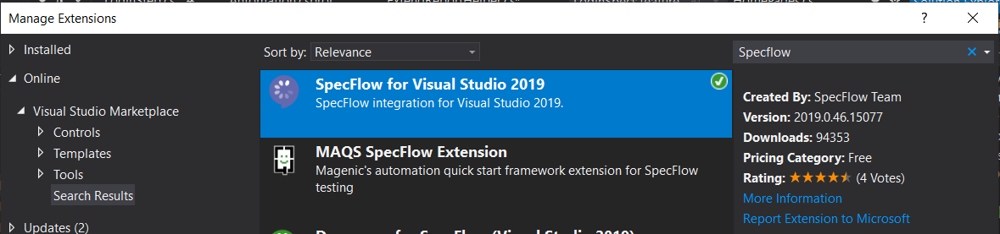
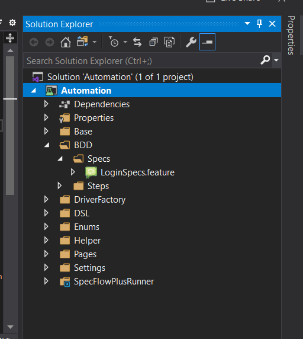
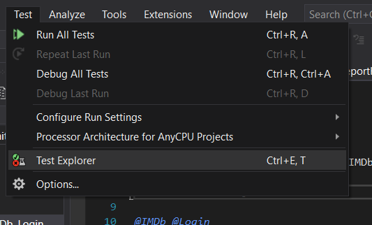
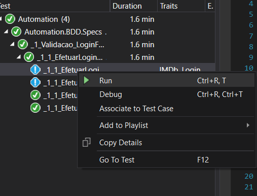
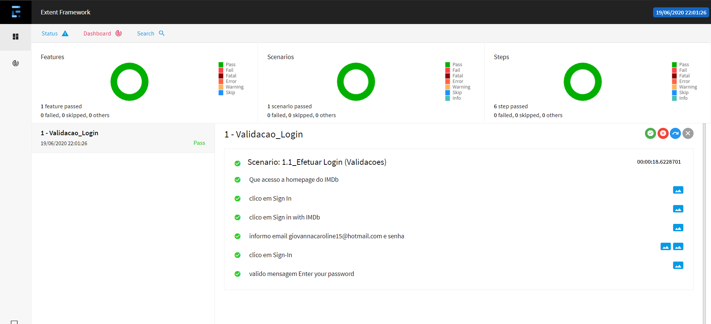

# Automação IMDb

Esse projeto tem como objetivo exemplificar o funcionamento do processo de automatização using [C#], [Specflow] e [Selenium] para aplicação web.

## Ferramentas

Para desenvolver neste projeto a ferramenta utilizada é o [Visual Studio].

Após a instalação do [Visual Studio] você deve instalar a extensão do [SpecFlow], para isso siga esse passo a passo.

1. Abra o Visual Studio.
2. Clique no menu `Extensions`.
3. Depois na opção `Manage Extensions`.
4. Seleciona a opção `Visual Studio Marketplace` no lado esquerdo da janela e digite no campo de busca `Specflow` e aperte enter.
5. Instale a extensão `SpecFlow for Visual Studio 2019` e siga o procedimento de instalação.



## Compilando o projeto

Com o projeto aberto no [Visual Studio], vá até o `Solution Explorer` que na instalação padrão do [Visual Studio] se encontra do lado direito na janela e clique com o botão direito no projeto `Automation`.

Será aberto um pop-up, neste pop-up clique na opção `Build` ou `Rebuild`.



## Executando um caso de teste

Nessa estrutura de projeto todos os casos de teste ficam armazenados na pasta `BDD/Specs`, os arquivos tem a extensão `.feature`, os arquivos desde formato, são similares a esse:

```specflow
#language:pt-BR
Funcionalidade:1 - Validacao_Login
	teste de login no site IMDb

Contexto: 
	Dado Que acesso a homepage do IMDb
	E clico em Sign In
	E clico em Sign in with IMDb

@IMDb @Login
Esquema do Cenário: 1.1_Efetuar Login (Validacoes)
	Quando informo email <email> e senha <senha>
	E clico em Sign-In
	Entao valido mensagem <mensagem>

	Exemplos: 
	| email                          | senha    | mensagem                                          |
	| giovannacaroline15@hotmail.com | teste123 | usuario logado                                    |
	| giovannacaroline15@hotmail.com |          | Enter your password                               |
	| testedagiovanna@hotmail.com    | teste12  | We cannot find an account with that email address |
	| giovannacaroline15@hotmail.com | teste12  | Your password is incorrect                        |
```

Aqui definimos o passo a passo e qual a massa de teste para teste diferentes cenários.

Para executar um desses testes, você deve abrir o explorador de testes. Para fazer isso clique no menu `Test` e clique na opção `Test Explorer`.



Será aberta uma janela que você poderá visualizar todos os casos de testes.

Para executar um deles, clique com o botão direito do mouse em cima do caso de teste desejado e clique na opção `Run`.



Ao clicar nessa opção o teste será executado e ao final desde teste será gerado um relatório da execução junto com as evidências.



[C#]: https://docs.microsoft.com/pt-br/dotnet/csharp/
[Specflow]: https://specflow.org/
[Selenium]: https://www.selenium.dev/
[Visual Studio]: https://visualstudio.microsoft.com/pt-br/
